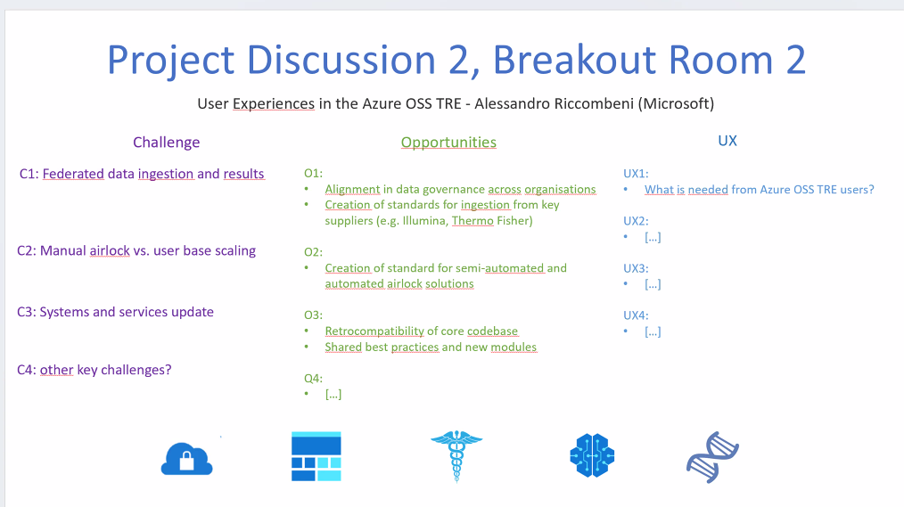

# Project discussion: User experience in the Azure OSS TRE

## Notes

Introduction to UX in Azure TREs and the functionalities that a user needs.
What is the key challenge as a user of a TRE?
What would solving the challenge unlock?

TREs can be very confusing to grasp from an outsider perspective, what's the best way to engage people in using TREs?

- Even technical people faced those things for the first time.
  Biggest issue as operator has been people saying "why cant I just do that?" and not appreciating how important TREs are and that without then you could do nothing at all, not even what is allowed.
- Our users (almost exclusively clinically active) just want the same experience they are used to having (on local hardware) but with access to the (restricted) data.
  Giving them the data is not possible so we replicate the world they are used to in the TRE.
  It really depends on your user base what your UX looks like.
  Recently going to the cloud gave us much more flexibility to provide many users what they want rather than trying them to change.
- There are different levels to look at.
  One is to replicate the environment users know, how much of this can we provide them?

Huge difference between useful and usable system.
How do we provide the latter?
There is a lot in how to communicate to users.
If you want this sensitive data you need a TRE.

## Chat/reflections

- Maybe a direct issue there - users not being builders, builders not being users?
- 100% getting users involved as early as possible is really important.
  As builders don't necessarily know what user need, but often feel they do.
  Flexibility is key - meet users where they are whenever possible.
- is there a cost to having that flexibility?
  Manageable cost?
  - The cost could come with customisation of the environment or the fact a user is used to a big GPU cluster, but in the cloud they need to adjust the way of working as that big GPU cluster on all the time isn't financially viable.
  - There’s a maintenance/management cost in terms of support.
    The more flexible you are the more maintenance overhead there is.

Would a TRE user group linked to this community potentially be an interesting thing to think about?
Like a sort of large 'pool' of users and a place where broadly speaking users could come to bridge the gap to the 'builders' of TREs (i.e. this community)?

- In theory yes, but comes back to that question of scope creep and priorities of the group.
  With current "resources" for this group it would need to be 1 of 2/3 working groups with clear focus on making something happen over next few months

TRE concept itself can be confusing.
Build vs. use, what is a concept vs. what is usable.
More clarity on what is possible is needed for end users.

- TRE operators are a user class on their own.
  How many researchers multiclass, and how many need a specialist?
- Software users new to a TRE expect to see a similar experience to the world they are used to e.g their laptop
- Giving users HPC, ML etc. is an incentive to get up to speed and familiar
- Useful vs. usable
- In some projects, more users collaborate on less sensitive data

## Summary

Quite a varied discussion, couple points that came up there is a growing complexity and it is important to involve users from the beginning and understand them.
There is a shift in past years from a tailored tech solution to providing organisational wide solutions.
